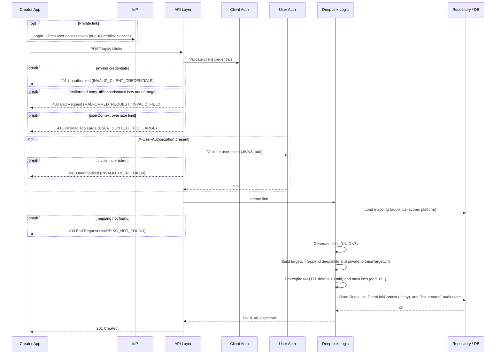

# Creation Flow

This document defines the flow for creating deep links using the Deeplink Service. Each `break` block is an early exit: the request stops there with the shown response.

```mermaid
sequenceDiagram
    participant Creator as Creator App
    participant IdP as IdP
    participant API as API Layer
    participant CA as Client Auth
    participant UA as User Auth
    participant CORE as DeepLink Logic
    participant REPO as Repository / DB

    opt Private link
        Creator->>IdP: Login + fetch user access token (aud = Deeplink Service)
    end
    Creator->>API: POST /api/v1/links

    API->>CA: Validate client credentials
    break invalid credentials
        API-->>Creator: 401 Unauthorized (INVALID_CLIENT_CREDENTIALS)
    end

    break malformed body, ttlSeconds/maxUses out of range
        API-->>Creator: 400 Bad Request (MALFORMED_REQUEST / INVALID_FIELD)
    end
    break userContext over size limit
        API-->>Creator: 413 Payload Too Large (USER_CONTEXT_TOO_LARGE)
    end

    opt X-User-Authorization present
        API->>UA: Validate user token (JWKS, aud)
        break invalid user token
            API-->>Creator: 401 Unauthorized (INVALID_USER_TOKEN)
        end
        UA-->>API: sub
    end

    API->>CORE: Create link
    CORE->>REPO: Load mapping (audience, scope, platform)
    break mapping not found
        API-->>Creator: 400 Bad Request (MAPPING_NOT_FOUND)
    end

    CORE->>CORE: Generate linkId (UUID v7)
    CORE->>CORE: Build targetUrl (append deeplinkId and private to baseTargetUrl)
    CORE->>CORE: Set expiresAt (TTL default 10 min) and maxUses (default 1)
    CORE->>REPO: Store DeepLink, DeepLinkContext (if any), and "link created" audit event
    REPO-->>CORE: ok

    CORE-->>API: linkId, url, expiresAt
    API-->>Creator: 201 Created
```
