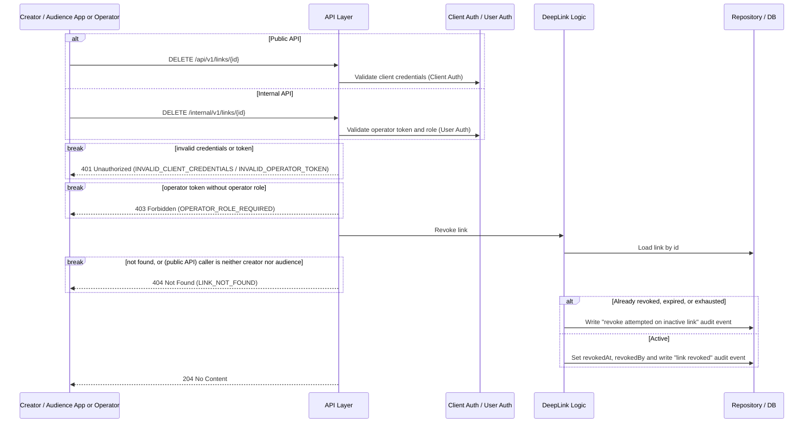

# Revocation Flow

This document defines the flow for revoking deep links. Each `break` block is an early exit: the request stops there with the shown response.

```mermaid
sequenceDiagram
    participant Caller as Creator / Audience App or Operator
    participant API as API Layer
    participant AUTH as Client Auth / User Auth
    participant CORE as DeepLink Logic
    participant REPO as Repository / DB

    alt Public API
        Caller->>API: DELETE /api/v1/links/{id}
        API->>AUTH: Validate client credentials (Client Auth)
    else Internal API
        Caller->>API: DELETE /internal/v1/links/{id}
        API->>AUTH: Validate operator token and role (User Auth)
    end
    break invalid credentials or token
        API-->>Caller: 401 Unauthorized (INVALID_CLIENT_CREDENTIALS / INVALID_OPERATOR_TOKEN)
    end
    break operator token without operator role
        API-->>Caller: 403 Forbidden (OPERATOR_ROLE_REQUIRED)
    end

    API->>CORE: Revoke link
    CORE->>REPO: Load link by id
    break not found, or (public API) caller is neither creator nor audience
        API-->>Caller: 404 Not Found (LINK_NOT_FOUND)
    end

    alt Already revoked, expired, or exhausted
        CORE->>REPO: Write "revoke attempted on inactive link" audit event
    else Active
        CORE->>REPO: Set revokedAt, revokedBy and write "link revoked" audit event
    end

    API-->>Caller: 204 No Content
```
